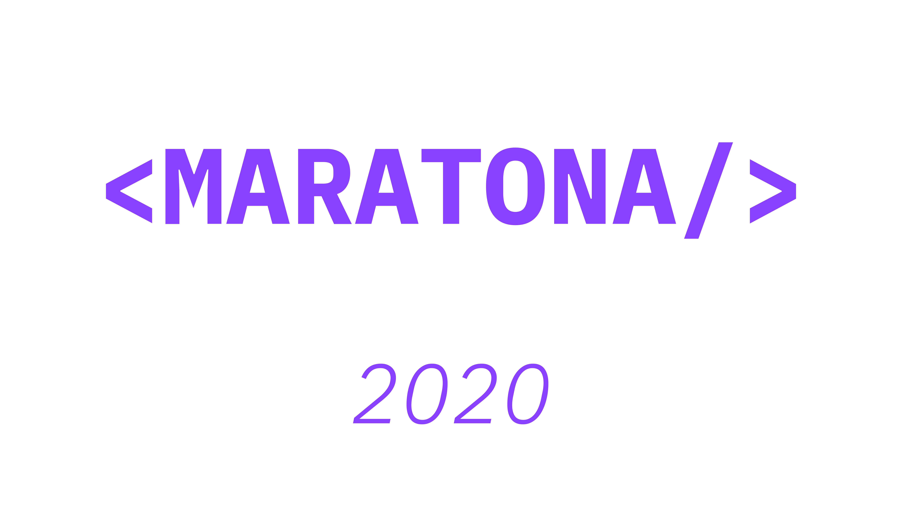
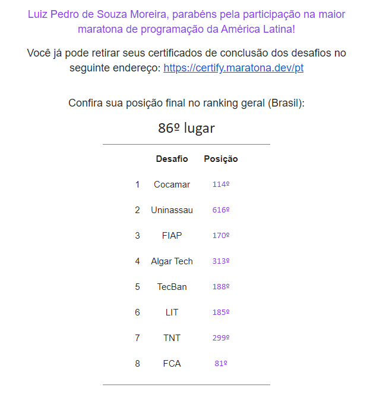

# Maratona Behind the Code 2020

<h1 align="center">
    
</h1>

## Desafios

1. [Desafio 01 | Cocamar](https://github.com/maratonadev-br/desafio-1-2020)
2. [Desafio 02 | UNINASSAU](https://github.com/maratonadev-br/desafio-2-2020)
3. [Desafio 03 | FIAP](https://github.com/maratonadev-br/desafio-3-2020)
4. [Desafio 04 | Algar](https://github.com/maratonadev-br/desafio-4-2020)
5. [Desafio 05 | Tecban](https://github.com/maratonadev-br/desafio-5-2020)
6. [Desafio 06 | LIT](https://github.com/maratonadev-br/desafio-6-2020)
7. [Desafio 07 | TNT](https://github.com/maratonadev-br/desafio-7-2020)
8. [Desafio 08 | Fiat Chrysler Automobiles](https://github.com/maratonadev-br/desafio-8-2020)

## Resultado

<h1 align="center">
    
</h1>

## Certificado

<h1 align="center">
    
</h1>
